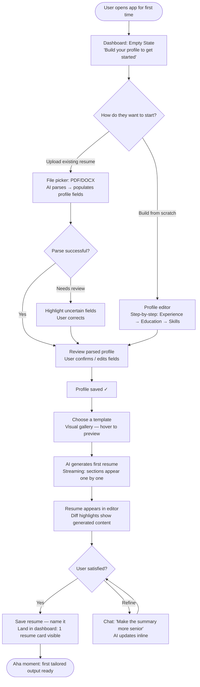
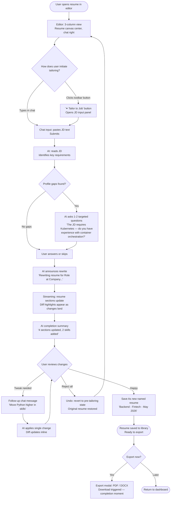
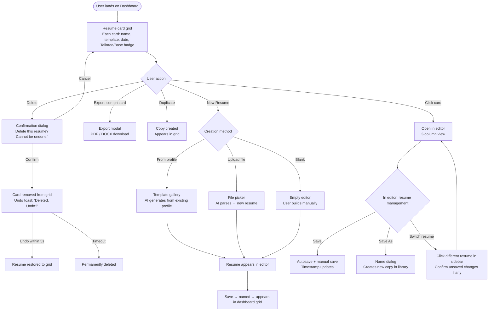

# UX Design Specification resume-enhancer

**Author:** Tsvetan
**Date:** 2026-05-13

---

<!-- UX design content will be appended sequentially through collaborative workflow steps -->

## Executive Summary

### Project Vision

Resume Enhancer is a full-lifecycle AI-driven resume tool built on a single core insight: **write once, tailor infinitely**. Users build a persistent experience profile one time; every subsequent job application reduces to selecting a template and pasting a job description — the AI rewrites their resume using their own words and real achievements, optimized for that specific role in seconds.

The product's signature UX innovation is **chat-to-document editing**: a conversational AI panel that directly mutates live resume content. Users don't get suggestions to manually apply — they describe what they want in natural language and the document updates in front of them. This positions Resume Enhancer not as a form-fill utility but as a collaborative career writing partner.

### Target Users

**Jordan — The Recent Graduate (Create Path)**
No polished resume, applying broadly. Tech-comfortable desktop user who needs structure and quick wins. The experience profile onboarding is her first interaction and must convert effort into visible value fast. She's the user whose "aha moment" defines whether the product delivers on its promise.

**Marcus — The Career Pivoter (Upload Path)**
Has an existing resume in DOCX, needs it reframed for a new industry. A natural power user of the conversational AI — he'll drive the most iterative, back-and-forth chat interactions. The upload → auto-extraction → profile review flow must feel effortless and trustworthy.

**Priya — The Power User (Multi-version Path)**
Actively managing 20+ applications simultaneously, two distinct resume variants, fine-grained control expectations. She will break things the others won't find. The recovery path — correcting an AI mistake through chat — must work the first time, every time. Resume versioning (save vs. save-as) must be unambiguous.

**Sam — The Administrator**
Developer/maintainer managing templates and user accounts. Not a job seeker. His UX needs are operational: clarity, efficiency, no surprises. The admin panel is a supporting context, not a showcase.

### Key Design Challenges

1. **The split-attention problem** — The resume editor and chat panel must coexist without either feeling cramped or secondary. Users need to watch AI changes land in the document while still composing their next message. This two-pane orchestration is the hardest layout challenge in the product and the one most likely to make or break the signature experience.

2. **Trust calibration with AI** — Users must trust AI suggestions enough to accept them, while feeling safe enough to reject or correct them without anxiety. The accept/reject pattern plus chat-as-correction must feel fluid and low-stakes. A wrong AI edit that takes more than one chat message to fix erodes confidence in the entire system.

3. **Onboarding the profile** — The experience profile is the foundation of everything, but filling it in is effort before value. Getting Jordan through that first 10 minutes without abandonment requires the UI to frame every input as *investment*, not *homework* — showing progress toward a concrete, imminent payoff.

4. **Resume state clarity** — Multiple named resumes, save vs. save-as, clone, templates, and sections that can be hidden create real risk of "what am I editing right now?" confusion. The current document's identity must always be crystal clear in the interface.

### Design Opportunities

1. **The "aha moment" as choreography** — The JD paste → instant AI rewrite is the product's killer feature. Every design decision leading up to that moment is an opportunity to build anticipation and remove friction. The UX can deliberately guide users toward this moment as a structured journey, not a feature they stumble on.

2. **Chat as the universal escape hatch** — Rather than building complex UI controls for every edge case, the chat panel serves as the correction mechanism for everything the UI doesn't expose. This is an architectural simplification opportunity: lean into conversational correction so the visual interface can stay clean.

3. **Progressive disclosure for complexity** — Show/hide sections, inline editing, versioning, and template customization are power-user features. Designed as progressive layers, they remain invisible to Jordan while being immediately accessible to Priya — without making the interface feel dumbed down for either.

## Core User Experience

### Defining Experience

The heartbeat of Resume Enhancer is the **JD tailoring loop**: open a resume → paste a job description → AI engages with clarifying questions if it finds gaps → AI rewrites the resume using the user's own words and the JD's language → user refines via chat → export. This is the primary recurring action for every job seeker user and the moment the product's value is most viscerally felt.

The single most critical interaction to get right is the **JD paste → AI engagement → rewrite sequence**. This is where the product either earns lasting trust or loses it permanently. Entry is simple (one text area, one action), but the experience accommodates a natural conversational exchange before the final rewrite lands — the AI asks targeted follow-up questions inline when it identifies gaps between the JD requirements and the user's profile. The user is in dialogue, not waiting.

The **chat panel** is not a sidebar feature — it is the product's primary power tool and the natural home for AI clarification, correction, and exploration at every stage of the workflow.

### Platform Strategy

- **Desktop-first web SPA** (React 18+ / TypeScript / Vite). Resume editing is inherently a focused desktop task; the interface is designed for that context.
- **Mouse and keyboard primary** — touch and tablet are graceful degradation, not an optimized use case.
- **Responsive to 1024px**; mobile layout degrades gracefully but is not a design target.
- **No offline requirement** — all AI inference runs server-side via Ollama; the app requires an active connection.
- **SSE for streaming AI output** — token-by-token chat responses and live document preview updates delivered one-directionally from server to client. No WebSocket complexity.
- **No native mobile application** in scope.

### Effortless Interactions

- **Upload → profile population**: After uploading a PDF or DOCX, the user should never need to retype what the parser already extracted. Present extracted data for confirmation and correction — not a blank form.
- **JD paste → tailoring**: A single text area and a single action to initiate. No multi-step wizard. The AI takes over from there.
- **Chat → document update**: The user's natural language instruction becomes a document edit with no intermediate steps. The change is visible in the preview as it streams.
- **Save and export**: Always one action away from the current editor state. Never buried in a menu hierarchy.
- **Autosave**: Profile fields and resume edits save automatically. The user should never lose work and never need to think about saving during editing — only when explicitly naming or versioning a resume.

### Critical Success Moments

1. **"It read my resume"** — After upload or profile entry, the first generated resume preview feels personal and accurate. If it looks like it was made for this specific user, they're invested.
2. **"It knows this job"** — After JD tailoring, the rewritten resume uses the posting's exact language and priorities. This is the aha moment. If it lands convincingly, the product is sticky.
3. **"It did what I said"** — After a chat correction, the document updates exactly as requested. This builds trust in the AI as a reliable collaborator, not an unpredictable black box.
4. **Make-or-break: recovery** — If the AI tailoring output is clearly wrong and the user cannot easily correct or recover from it, the product fails. The correction path (chat-as-undo) must be a first-class design concern, not an afterthought.

### Experience Principles

1. **Every interaction earns the next one** — From profile entry to first preview to tailoring, each step must deliver enough immediate value to justify the next ask. Never accumulate effort before reward.
2. **The chat panel is a first-class citizen** — It is the product's most powerful tool and the primary mechanism for clarification, correction, and exploration. Design treats it as equal to the resume editor, not subordinate.
3. **AI mistakes are expected; recovery must be instant** — The UX assumes the AI will occasionally get it wrong and designs the correction path to be faster than the original action. One chat message should fix any AI error.
4. **AI clarification is part of the tailoring flow, not an interruption** — When the AI identifies gaps between JD requirements and the user's profile, it asks targeted follow-up questions conversationally before rewriting. The user is in engaged dialogue, not blocked waiting.
5. **Desktop precision, no mobile compromise** — Design decisions optimize for focused, intentional desktop work sessions. Don't sacrifice editing fidelity for responsive flexibility.
6. **State is never ambiguous** — The user always knows: which resume they're editing, what template is active, which sections are visible, and what the AI most recently changed.

## Desired Emotional Response

### Primary Emotional Goals

Resume Enhancer enters an emotionally loaded context — the job search is already saturated with anxiety, self-doubt, and hope. The product's job is not merely to be useful; it must make users feel **competitive and in control of their own story**.

The primary emotional goal is: *"My experience is impressive — it just needed better framing, and now I have it."* This is the feeling of professional self-efficacy: the user's career history hasn't changed, but their ability to communicate it has been transformed. When the tailored resume lands using the job posting's exact vocabulary framed around the user's real achievements, it should feel like revelation, not just utility.

### Emotional Journey Mapping

| Stage | Desired Feeling | Emotion to Avoid |
|---|---|---|
| First arrival / sign-up | Curious, low-commitment | Overwhelmed |
| Profile entry | Invested, making visible progress | Bored, tempted to abandon |
| First resume preview | Pleasantly surprised, seen | Underwhelmed, "just a template" |
| JD paste + AI dialogue | Engaged, collaborative | Anxious waiting, uncertain |
| Seeing the rewritten resume | **Amazed, validated** | Skeptical, "this isn't me" |
| Chat correction lands | Trusted, in control | Frustrated, "it didn't listen" |
| Export | Accomplished, ready to submit | Anticlimactic |
| Return visit | Efficient, at home | Confused, disoriented |

The emotional arc across a first session moves from *curious* → *invested* → *amazed* → *accomplished*. Every UX decision should protect and advance this arc.

### Micro-Emotions

**Trust vs. Skepticism** — the most critical axis for this product. Every AI output either builds or erodes trust. The accept/reject UI, chat corrections, and the AI's explanation of what it changed are all trust mechanisms. A single unexplained or unreversible AI mistake can collapse trust built across an entire session.

**Confidence vs. Anxiety** — The job search is already anxiety-laden; the product must not compound it. Clear state indicators, predictable AI behavior, autosave, and easy recovery are anxiety-reduction mechanisms as much as they are technical features.

**Accomplishment vs. Frustration** — Export is the emotional release valve. Every friction point before it accumulates frustration; every smooth interaction accumulates toward the accomplishment payoff at the end.

**Delight vs. Satisfaction** — The aha moment should be *delight* (unexpected, exceeds expectation) rather than mere satisfaction. The AI using the JD's exact vocabulary wrapped around the user's real achievements should feel like magic the first time it happens.

### Design Implications

- **Empowerment** → Accept/reject controls are always visible and accessible; chat corrections feel instant and respected; no action is irreversible without a clear recovery path
- **Trust** → AI explains what it changed and why after every action; streaming output feels alive and transparent, not a black box; suggestions are specific and grounded in the user's actual profile, never generic filler
- **Efficiency** → Zero re-entry of data; autosave throughout; one-click export; the JD tailoring entry is a single text area and a single action
- **Delight at the aha moment** → The JD tailoring result is presented with a sense of transformation — not just text updated quietly, but a moment the interface frames as significant
- **Anxiety reduction** → Progress indicators during AI inference; clear "what's happening" messaging during streaming; no silent failures; Ollama unavailability surfaces a friendly degraded state rather than a broken experience

### Emotional Design Principles

1. **Protect the arc** — Every design decision should advance the emotional journey from curious → invested → amazed → accomplished. Any interaction that stalls or reverses the arc needs to be redesigned.
2. **Trust is fragile, build it deliberately** — Every AI output includes explanation; every mistake has a one-message fix; no data is ever silently lost or overwritten.
3. **Anxiety and friction are the enemy** — Autosave, clear state, predictable AI behavior, and graceful degradation when Ollama is unavailable all serve the same goal: removing the cognitive load the job search already imposes.
4. **The aha moment is a designed event** — The JD tailoring result is the product's emotional peak. The UI should frame it as a transformation, not a text update.

## UX Pattern Analysis & Inspiration

### Inspiring Products Analysis

**Cursor** — The closest existing analogue to Resume Enhancer's core UX: a split-pane editor and AI chat where chat messages become direct document edits, with streaming output and inline change explanations. Cursor solves the split-attention problem by treating the editor and chat panel as equal-weight peers, not master and subordinate. Diff highlighting shows exactly what the AI changed — users don't have to hunt for modifications. Change explanations appear contextually inline, not in a disconnected sidebar.

**Notion** — Rich structured document editing in a web SPA with clean two-pane layouts and progressive disclosure of power features. Block-level editing makes every section a discrete, editable unit — show/hide and reorder feel natural. Onboarding converts effort to visible output immediately: the first document looks polished before significant work has been done, establishing the emotional pattern of "input yields visible reward."

**ChatGPT** — Streaming AI conversation UX that Resume Enhancer's target users already have deep muscle memory for. Token-by-token streaming feels alive and trustworthy. The conversation thread as interaction record means users can scroll back and understand the full AI session. Follow-up questions land naturally in the same thread with no context switch between "AI mode" and "edit mode."

**Canva** — Template library as visual browsing experience with thumbnails, hover preview, and one-click apply. The document canvas is always front and center — never hidden behind a form. Export is treated as a celebrated completion moment, not a file-save utility action.

### Transferable UX Patterns

**Navigation Patterns:**
- Sidebar resume list (Notion-style) — keeps the full resume library accessible without leaving the editor context
- Tab or toggle between resume editor and experience profile — avoids full-page navigation for frequent context switches

**Interaction Patterns:**
- Split-pane peer layout: editor and chat at equal visual weight (Cursor) — directly addresses the split-attention problem
- Inline diff highlighting when AI applies edits (Cursor) — users see exactly what changed, where, without hunting
- Streaming token-by-token output in the chat panel (ChatGPT) — trust signal that the AI is working; already familiar to users
- Conversation thread as session audit trail — every AI action (tailoring, enhancement, correction) logged in chronological order
- Block-level section editing with show/hide toggle per section (Notion) — natural granularity for resume structure
- Clarification questions appear in the same chat thread as the original request — no modal interruption, no context switch

**Visual Patterns:**
- Visual template gallery with thumbnail and hover preview (Canva) — template selection as browsing, not form-filling
- Resume preview as primary canvas — the document is always visible and central, never behind a tab
- Export as a deliberate completion ritual (Canva) — frames the end of the workflow as an accomplishment

### Anti-Patterns to Avoid

- **Modal-heavy interruption flows (Jobscan)** — every action breaks focus with a dialog; document and AI analysis live in separate worlds. Resume Enhancer's document and AI panel must never be separated.
- **Linear wizard imprisonment (Zety)** — multi-step form wizard with no way to jump back or skip ahead. Profile entry should feel open and nonlinear, not sequential and trapped.
- **Disconnected sidebar suggestions (Google Docs AI)** — suggestions appear in a sidebar with no visual connection to the text they affect; users must manually map suggestions to document locations. Inline diff highlighting (Cursor-style) is categorically superior.
- **Silent spinners during AI inference** — a blank spinner for 10–30 seconds breeds anxiety. Streaming output, even partial tokens, communicates active work and maintains trust throughout the wait.

### Design Inspiration Strategy

**Adopt directly:**
- Cursor's split-pane peer layout (editor and chat at equal visual weight)
- Cursor's inline diff highlighting for AI-applied changes
- ChatGPT's streaming token-by-token output in the chat panel
- Canva's visual template gallery with hover preview and one-click apply

**Adapt:**
- Notion's block-level editing → adapted for resume sections (experience, education, skills) with per-section show/hide toggle
- Canva's export-as-celebration → adapted to Resume Enhancer's named resume save + export as a meaningful completion moment
- ChatGPT's conversation thread as record → adapted so every AI action (tailoring, enhancement, correction) is logged in the chat thread, giving users full session transparency and a natural undo path via follow-up message

**Avoid:**
- Modal-heavy interruption patterns (Jobscan model)
- Sequential wizard flows that prevent non-linear navigation (Zety model)
- Sidebar AI suggestion panels disconnected from document location (Google Docs AI model)
- Silent progress indicators during AI inference of any duration

## Design System Foundation

### Design System Choice

**Tailwind CSS + shadcn/ui** — built on Radix UI primitives.

The PRD already commits the project to React 18+ / TypeScript / Vite / Tailwind CSS. shadcn/ui is the natural and deliberate component layer on top of this stack.

### Rationale for Selection

- **Owned code, not a dependency** — shadcn/ui components are copied into the project and fully customizable at source. No version lock-in, no override complexity, no upstream breaking changes.
- **Radix UI primitives = WCAG 2.1 AA out of the box** — keyboard navigation, focus management, and screen reader labels are built into every component, directly satisfying NFR19 and NFR20 without custom accessibility work.
- **Aesthetic alignment** — shadcn/ui's default theme (neutral grays, clean typography, minimal chrome) maps directly to the Notion/Cursor/Linear aesthetic established in the inspiration analysis. It will look right with minimal customization.
- **Portfolio signal** — shadcn/ui is the current industry standard for React + Tailwind production applications. It reads as an informed, deliberate architectural choice to any engineer reviewing the codebase.
- **Development velocity** — pre-built Dialog, Dropdown, Toast, Sheet (slide-over panel ideal for the chat panel), Tabs, and Form components cover the majority of Resume Enhancer's UI surface without building from scratch.

### Implementation Approach

- Initialize shadcn/ui via CLI into the Vite + React + Tailwind project
- Install components on-demand as needed (no bulk import)
- Use shadcn/ui's Sheet component for the chat panel slide-over on narrower viewports; full split-pane on desktop
- Use shadcn/ui's Dialog for confirmation flows (delete resume, save-as naming)
- Use shadcn/ui's Toast for non-blocking feedback (save confirmed, export ready, AI error states)
- Custom components (resume preview renderer, split-pane layout, diff highlight overlay, template gallery card) built alongside shadcn/ui using the same Tailwind token layer

### Customization Strategy

Establish a minimal set of design tokens in Tailwind's `theme.extend` configuration:
- **Primary color** — a single professional accent (slate-based or neutral blue; not a loud brand color)
- **Neutral palette** — shadcn/ui's default zinc/slate scale; no custom grays needed
- **Border radius** — slightly rounded (md) for a modern but professional feel aligned with the Notion/Linear aesthetic
- **Typography** — Inter or Geist (system-native feel, excellent legibility at resume-editing scale)
- **Spacing scale** — Tailwind defaults; no custom spacing needed

All shadcn/ui components inherit these tokens automatically. Custom components follow the same token contract so the visual language stays consistent across the entire product.

## Core User Experience

### Defining Experience

> **"Paste a job description, watch your resume rewrite itself to match it — using your own words."**

This is the moment that defines Resume Enhancer. Every other feature is infrastructure to reach this moment or to let users repeat it effortlessly. The product's entire UX is organized around making this one interaction inevitable, fast, and trustworthy.

### User Mental Model

Users arrive with two existing mental models that Resume Enhancer must unify:

**Word processor model** (Google Docs, Word) — the document is something you *edit* directly. Users expect sections, cursor placement, undo/redo, and visible control over every character.

**Chat AI model** (ChatGPT) — you *describe* what you want in natural language and it appears. Users expect streaming output and follow-up messages to refine results.

Resume Enhancer combines these into a novel hybrid: **the chat is the document editing interface**. Users who arrive as word processor thinkers may initially try to edit everything manually. Users who arrive as AI chat thinkers may over-rely on the AI for things they could do faster by hand. The UX guides both types toward the unified mental model through the experience itself — no tutorial required.

**Current workflow users are already doing manually:** Copy resume into ChatGPT → paste JD → request rewrite → copy output back into Word → reformat → fix AI errors → repeat. This is 8–12 manual steps. Users already believe AI can do this job — they just hate the copy-paste loop. Resume Enhancer's mental model is already primed; the product just needs to eliminate the friction.

### Success Criteria

- The rewritten resume appears *in the document*, not in the chat — the user never copies or pastes output
- AI changes are visually distinct (diff highlighting) so the user immediately sees what changed and where
- The full loop — JD paste → any clarifying dialogue → rewrite visible in document — completes in under 60 seconds of active user time (excluding AI inference wait)
- Any AI mistake is correctable with a single follow-up chat message
- The rewritten resume still feels like the user's voice — their achievements, their words, better framed

### Novel UX Patterns

The JD tailoring loop is **novel** — no mainstream resume tool performs live document editing via AI conversation. However, it is assembled from individually familiar patterns:

- Text area + submit (universal)
- Streaming chat response (ChatGPT-familiar)
- Reactive document preview (Google Docs-familiar)
- Diff highlighting (GitHub/Cursor-familiar; needs clear visual affordance for non-technical users)

**Teaching strategy:** No onboarding tour is needed. The interaction is its own tutorial — the first time a user pastes a JD and watches their document transform, the mental model installs itself. The design relies on the experience being self-evidently correct on first contact.

### Experience Mechanics

**1. Initiation**
- A persistent "Tailor to Job" action in the editor toolbar — always visible, never buried in a menu
- The AI may also suggest it proactively in chat after a resume draft exists: *"Want to tailor this to a specific role? Paste the job description here."

**2. Interaction**
- User pastes JD into the chat input or a dedicated expandable text area
- Single action to submit (Enter or button)
- AI streams: acknowledges the JD, identifies key requirements, asks 1–2 targeted clarifying questions if profile gaps exist
- Once context is sufficient, AI announces the rewrite and streams changes directly into the document preview

**3. Feedback**
- Diff highlighting marks changed sections in the preview as edits land (distinct color for rewrites, additions)
- Chat panel confirms each major change with a plain-language summary: *"Moved Python to the top — matches their primary requirement. Reframed your team lead bullet to emphasize product outcomes."
- Streaming output makes the inference wait feel active and transparent, not like a black box

**4. Completion**
- AI signals completion with a brief summary: *"Tailored to [role title]. 4 sections updated, 2 skills reordered."
- Accept/reject controls appear for the full tailoring batch; individual changes correctable via follow-up chat message
- Save, Save As, and Export actions immediately available from the editor with no additional navigation required

## Visual Design Foundation

### Color System

**Palette: "Slate Professional"** — restrained, neutral, serious-tool aesthetic aligned with Notion/Linear/Cursor inspiration. The UI chrome recedes so the resume preview remains the focal point of every screen.

| Role | Token | Value | Rationale |
|---|---|---|---|
| Background | `bg-background` | `zinc-50` / `white` | Clean, untinted, lets the resume preview breathe |
| Surface | `bg-card` | `white` / `zinc-100` (dark mode) | Elevated panels: editor, chat, sidebar |
| Border | `border` | `zinc-200` | Subtle structure, not heavy |
| Text primary | `text-foreground` | `zinc-900` | High contrast, readable |
| Text muted | `text-muted-foreground` | `zinc-500` | Secondary labels, captions, metadata |
| Primary accent | `primary` | `blue-600` | CTAs, active states, links — trust-signaling, professional |
| Primary hover | `primary/90` | `blue-700` | Interaction feedback |
| Diff highlight (addition) | custom | `emerald-100` bg / `emerald-700` text | AI-added content — positive, visible |
| Diff highlight (rewrite) | custom | `amber-100` bg / `amber-700` text | AI-rewritten content — neutral attention |
| Destructive | `destructive` | `red-600` | Delete actions, error states |
| Success | custom | `emerald-600` | Save confirmed, export ready |
| AI streaming indicator | custom | `blue-400` pulsing | Active inference — communicates work in progress |

**Dark mode:** shadcn/ui's built-in CSS variable dark mode; `zinc-950` background, `zinc-100` foreground. Same accent colors function at both luminosities.

**Accessibility:** `blue-600` on white = 4.5:1 contrast ratio (WCAG AA pass). `zinc-900` on `zinc-50` = 16:1 (AAA). All interactive elements meet WCAG 2.1 AA minimum contrast requirements.

### Typography System

**Primary font:** Inter (Google Fonts). System-native feel, excellent legibility at small sizes in dense UIs. Fallback: `ui-sans-serif, system-ui, sans-serif`.

**Resume preview font:** Controlled by the selected template, independent of UI chrome. Traditional templates use Georgia/Times New Roman; modern templates use Inter. Template fonts do not affect UI typography.

**Type scale:**

| Level | Size | Weight | Use |
|---|---|---|---|
| `text-2xl` | 24px | 600 | Page titles, resume candidate name |
| `text-xl` | 20px | 600 | Section headings |
| `text-lg` | 18px | 500 | Card titles, editor headings |
| `text-base` | 16px | 400 | Body text, chat messages |
| `text-sm` | 14px | 400 | Labels, metadata, secondary info |
| `text-xs` | 12px | 400 | Timestamps, hints, badges (never primary content) |

**Line height:** `leading-relaxed` (1.625) for body and chat content; `leading-tight` (1.25) for headings and UI labels.

### Spacing & Layout Foundation

**Base unit:** 4px (Tailwind default). All spacing in multiples of 4.

**Density:** Medium-dense — productivity tool register, not a marketing page. Sufficient breathing room to feel professional; not so spacious the editor feels wasteful on a 1440px desktop screen.

**Primary layout — editor view (three-column, screens ≥ 1280px):**
- **Left sidebar** `w-64` (256px) — resume list, navigation, profile access
- **Center column** `flex-1` — resume preview canvas (primary canvas, always visible and centered)
- **Right panel** `w-96` (384px) — chat panel (collapsible to icon rail on narrower viewports)

**Resume preview canvas:** Fixed A4 aspect ratio (1:1.414), fixed width, scrollable vertically. Centered in its column with a drop shadow to communicate "this is a document, not a form." Background behind the canvas: `zinc-100` to create contrast between the document surface and the app chrome.

**Component spacing:**
- Card padding: `p-4` to `p-6`
- Section gaps: `gap-4` to `gap-6`
- Chat message spacing: `gap-3` between bubbles
- Editor toolbar: `h-12`, sticky at top of center column

### Accessibility Considerations

- All color choices meet WCAG 2.1 AA contrast minimums as specified in the color system above
- `text-base` (16px) minimum for all primary readable content; `text-xs` reserved for supplementary metadata only
- Focus rings: shadcn/ui default `ring-2 ring-offset-2 ring-primary` — visible on all interactive elements without exception
- Diff highlight colors (emerald, amber) are never the sole indicator of change — always paired with an icon or text label to satisfy WCAG 1.4.1 (no color-only communication)
- AI streaming indicator uses animation and color together, not color alone
- Chat panel and resume preview maintain logical DOM reading order for screen readers regardless of visual column layout
- Focus is managed programmatically when dialogs open/close and when AI responses appear in the chat panel (satisfying NFR20)

## Design Direction Decision

### Design Directions Explored

Six directions were generated and evaluated across document focus, chat visibility, state clarity, onboarding quality, and persona fit:

- **D1: Command Center** — 3-column peer layout (Cursor-inspired), icon sidebar, editor and chat at equal weight
- **D2: Document First** — wide canvas, chat as collapsible drawer, AI action buttons (Tailor, Enhance) in toolbar
- **D3: Chat Native** — chat as primary interface, resume as output panel
- **D4: Minimal Studio** — full-bleed canvas, floating action bar, chat as overlay
- **D5: Power Sidebar** — wide sidebar with section management, section show/hide controls, AI change log
- **D6: Dashboard Hub** — resume card dashboard as home screen, then editor view

### Chosen Direction

**D1/D6 Hybrid** with three specific modifications:

1. **D6 dashboard as the home/landing screen** — resume card gallery with mini previews, tailored/base badges, and a prominent "New Resume" action. Experienced users bypass it quickly; new users orient immediately.
2. **D1 Command Center as the editor** — three-column layout with icon sidebar (left), resume preview canvas (center), and AI chat panel (right). Editor and chat are co-equal peers.
3. **Collapsible left sidebar** — the first column (icon sidebar + resume list) can be collapsed to an icon-only rail, giving the resume canvas more horizontal space when the user wants to focus on the document.
4. **Dedicated AI action buttons in the editor toolbar** (from D2) — "✦ Tailor to Job" and "✦ Enhance" as explicit toolbar buttons alongside the chat input. Reduces reliance on knowing to type in the chat; guides users who are not yet comfortable with AI conversation.
5. **Collapsible Sections panel** (from D5) — a dedicated collapsible panel in the left sidebar for adding, removing, and reordering resume sections (Experience, Education, Skills, Projects, etc.). Collapsed by default; expandable on demand.

### Design Rationale

- **Collapsible sidebar** balances the multi-resume management need (Priya, Marcus) against the need for a focused document canvas. The sidebar is present when needed, invisible when not.
- **Explicit AI action buttons** solve the discoverability problem for Jordan and first-time users who know what they want to do but don't know to express it as a chat message. Once users are comfortable, the chat input handles everything; the buttons are onboarding scaffolding that never disappears.
- **Sections panel** addresses a core power-user need (Priya's multi-version, role-specific section toggling) without cluttering the main editor canvas. Collapsible keeps it accessible but out of the way during writing.
- **D6 dashboard home** gives the resume library a proper first-class screen, making the library scannable and the "new resume" action prominent — the right default for an app that accumulates 3–10 resumes per user over time.

### Implementation Approach

- Left sidebar: two sub-columns rendered as a single collapsible unit. Collapsed state: 48px icon rail only. Expanded state: 48px icon rail + 192px resume list panel. Toggle via a chevron button at the top of the sidebar or a keyboard shortcut.
- Editor toolbar: static "✦ Tailor to Job" and "✦ Enhance" buttons render to the left of the chat input or as a distinct toolbar row above it. Clicking either pre-fills the chat input with a prompt template and focuses it, or opens a dedicated modal (for Tailor to Job, to accommodate the JD paste area).
- Sections panel: rendered as a shadcn/ui Collapsible component within the left sidebar, below the resume list. Includes add/remove toggles per section (checkbox list) and drag-to-reorder handles. Changes apply live to the resume preview.
- Dashboard home: separate route (`/`) vs. editor route (`/resumes/:id`). Navigation between them via the resume list sidebar item click or the back-to-dashboard button in the editor toolbar.

## User Journey Flows

### Journey 1: First-Time Onboarding

**Goal:** User goes from empty state → experience profile populated → first resume generated, feeling invested and capable within minutes.

**Entry:** New user lands on the D6 dashboard — empty state with a single prominent call to action.

**Optimization notes:**
- Upload path is fastest — one action converts existing work into profile. Priority path.
- Template gallery renders before generation starts so there is no dead wait
- AI generation streams section-by-section — user sees progress immediately
- Name prompt appears after the user has seen the result, not before

### Journey 2: JD Tailoring Loop

**Goal:** User takes an existing resume and produces a tailored version for a specific role in under 60 seconds of active user time.

**Entry:** User is in the editor with a resume open, or clicks "Open Editor" from the dashboard card.

**Optimization notes:**
- Both toolbar button and chat input lead to the same flow — no wrong way in
- AI clarification is maximum 1–2 questions, never a form — stays conversational
- Streaming and diff highlighting mean the user is never staring at a silent spinner
- "Save As" not "Save" — preserves the base resume, creates a named tailored copy automatically
- Undo is one action — no multi-step rollback required

### Journey 3: Resume Library Management

**Goal:** User manages their growing library of resumes — browsing, duplicating, exporting, deleting — from the dashboard and within the editor.

**Entry:** Dashboard home screen.

**Optimization notes:**
- Export from the card — no need to open the editor just to export
- Delete has a 5-second undo toast — no permanent data loss anxiety
- Duplicate is the primary way users create a new tailored version from a base resume
- Autosave in the editor means Save As is the only decision point (naming), not a save-vs-discard choice

### Journey Patterns

**Navigation patterns:**
- **Dashboard ↔ Editor**: two-screen navigation. No nested routes. Back button always returns to dashboard with resume grid intact.
- **Sidebar resume switch**: switching resumes within the editor reloads the center canvas and chat panel in place — no full navigation.

**Decision patterns:**
- **Two-path entry**: every major AI action (tailoring, enhancement) is reachable via toolbar button and chat input. No single correct path.
- **Confirm-before-destroy**: delete, revert, and overwrite always require an explicit confirmation step.

**Feedback patterns:**
- **Streaming as progress**: every AI action streams output token-by-token. No silent waiting at any point.
- **Diff highlighting as feedback**: every AI edit is visually marked on first appearance; fades to normal on next user interaction.
- **Completion summary**: every AI tailoring ends with a plain-language summary of what changed.
- **Undo toast for deletes**: 5-second soft-delete with undo toast before permanent removal.

### Flow Optimization Principles

1. **Shortest path to aha** — the JD tailoring loop requires no more than 3 user actions from an open resume: click Tailor → paste JD → submit. Everything else is optional refinement.
2. **No dead ends** — every error state and empty state has a clear next action. No user is ever stranded without a visible path forward.
3. **Preserve base resumes** — "Save As" is the default save action after AI tailoring. The base resume is never silently overwritten.
4. **AI mistakes are cheap to fix** — every AI output is followed by an active chat input. A correction is one message away with no modals or undo trees.
5. **Export is always one click away** — from the editor toolbar and from the dashboard card. The path from done to downloaded is never more than 2 clicks.

## Component Strategy

### Design System Components

**shadcn/ui (Radix UI) provides out of the box:**

- `Dialog` — confirmation dialogs, export modal, save-as naming, JD input panel
- `Sheet` — chat panel slide-over on narrower viewports
- `Toast` — undo delete toast, save confirmed, export ready, AI error states
- `Collapsible` — sidebar collapse, sections panel toggle
- `Tabs` / `Select` — template gallery navigation, resume type switcher
- `Form`, `Input`, `Textarea` — profile editor fields, chat input, JD paste area
- `Checkbox` — sections panel add/remove toggles
- `Button`, `Badge`, `Separator`, `Skeleton` — throughout all views

### Custom Components

Ten custom components are required for Resume Enhancer — not available in any component library, specific to the resume-editing and AI-chat domain:

#### `ResumeCanvas`

**Purpose:** Render resume data as a formatted, printable document preview that updates reactively as AI edits are applied.
**States:** `idle` (editable), `streaming` (AI writing, sections partially complete), `diff` (post-AI, highlights visible), `print-preview` (export-ready, chrome hidden)
**Accessibility:** Rendered as semantic HTML (`<article>`, `<section>`, `<h2>`, `<ul>`) for screen reader traversal; ARIA live region on the streaming container
**Implementation:** React component mapping resume data model to template-specific HTML; template styles injected via CSS class swap

#### `DiffHighlight`

**Purpose:** Visually communicate what the AI changed without requiring the user to hunt for modifications.
**States:** `visible` (immediately post-AI action), `faded` (after first user interaction), `hidden` (cleared)
**Accessibility:** Never color-only — always paired with `aria-label="AI addition"` or `aria-label="AI rewrite"` and a small icon
**Implementation:** Wraps changed text nodes in a styled `<mark>` element; cleared via global "dismiss diff" action or after next user edit

#### `ChatPanel`

**Purpose:** Full conversational AI interface — the primary interaction channel for tailoring, enhancement, and refinement.
**States:** `idle` (waiting for input), `streaming` (AI response in progress, streaming cursor visible), `error` (Ollama unavailable — shows degraded state message)
**Accessibility:** `aria-live="polite"` on the message list so screen readers announce new AI messages; focus trapped to input on panel open
**Implementation:** SSE consumer appending tokens to current AI message bubble in real time; conversation thread stored in component state and persisted to session

#### `SplitPaneLayout`

**Purpose:** Three-column editor layout with collapsible left sidebar — the structural container for the entire editor view.
**States:** `sidebar-expanded` (full three-column), `sidebar-collapsed` (icon rail only, center canvas and chat panel widen to fill)
**Accessibility:** Sidebar toggle has `aria-expanded` and `aria-label="Toggle sidebar"`; column resize does not trap focus
**Implementation:** CSS grid with transition on column template widths; collapse state persisted to `localStorage`

#### `SectionsPanel`

**Purpose:** Allow users to add, remove, and reorder resume sections without entering a separate edit mode.
**States:** `collapsed` (default — "Sections" header with chevron), `expanded` (checkbox list with drag handles)
**Accessibility:** Drag-to-reorder has keyboard alternative (up/down arrow on focused item); checkboxes have explicit labels
**Implementation:** shadcn/ui `Collapsible` wrapper; `@dnd-kit/sortable` for drag-to-reorder; changes dispatched to resume state and reflected live in `ResumeCanvas`

#### `ResumeSidebarItem`

**Purpose:** Resume list card in the left sidebar — name, template label, date, Tailored/Base badge, hover actions.
**States:** `default`, `active` (currently open), `hover` (shows action icons: duplicate, delete, export)
**Implementation:** Styled list item with conditional action icon reveal on hover/focus

#### `ResumeDashboardCard`

**Purpose:** The larger resume card on the D6 dashboard — mini preview thumbnail, badge, Open/Export/Duplicate/Delete actions.
**States:** `default`, `hover` (card lift shadow), `active` (blue border, featured)
**Implementation:** Card component with embedded mini `ResumeCanvas` render at reduced scale

#### `AIActionBar`

**Purpose:** Toolbar row containing `✦ Tailor to Job` and `✦ Enhance` buttons plus streaming status indicator.
**States:** `idle`, `active` (one action button highlighted while in progress)
**Implementation:** Static toolbar component; button clicks pre-fill chat input with a prompt template and focus it, or open the JD modal

#### `TemplateGallery`

**Purpose:** Visual grid of template thumbnails with hover preview, active selection state, and one-click apply.
**States:** `browsing`, `selected` (active template highlighted)
**Implementation:** Grid of `ResumeDashboardCard`-style thumbnails at small scale; template data drives `ResumeCanvas` style class

#### `StreamingIndicator`

**Purpose:** Animated inference-in-progress state — pulsing dot and label. Used in chat panel and resume canvas during generation.
**States:** `visible` (AI active), `hidden`
**Implementation:** CSS `pulse` animation on `bg-blue-400` dot; disappears when SSE stream closes

### Component Implementation Strategy

- All custom components are built using Tailwind CSS utility classes and shadcn/ui design tokens to guarantee visual consistency with the foundation layer
- Custom components copy the shadcn/ui pattern: source-owned files in `src/components/ui/`, not installed as a dependency — fully customizable at source
- Storybook stories are created alongside each custom component for isolated development and visual regression testing
- All components are typed with TypeScript interfaces; resume data model is the single source of truth shared between `ResumeCanvas`, `SectionsPanel`, `ResumeSidebarItem`, and `ResumeDashboardCard`

### Implementation Roadmap

**Phase 1 — Core editor (blocks the defining experience):**
- `SplitPaneLayout` — structural container for everything
- `ResumeCanvas` — without this, no editor
- `ChatPanel` with SSE streaming — the defining interaction
- `DiffHighlight` — core feedback mechanism
- `AIActionBar` — discoverability for new users

**Phase 2 — Library and navigation:**
- `ResumeSidebarItem` — sidebar resume list
- `ResumeDashboardCard` — D6 dashboard
- `SectionsPanel` — section management
- `StreamingIndicator` — polish on inference wait

**Phase 3 — Polish and template system:**
- `TemplateGallery` — visual template selection
- Template renderer variants (Minimal, Classic, Modern)
- Print-preview mode on `ResumeCanvas`

## UX Consistency Patterns

### Button Hierarchy

**Levels:**
- **Primary** (`btn-primary` — blue filled): one per view, the forward-moving action. Editor: **Save** / **Save As**. JD modal: **Tailor**. Export dialog: **Download**.
- **Secondary** (`btn-secondary` — bordered, white): alternatives that don't advance but aren't destructive. **Export ↓**, **Duplicate**, **Cancel**.
- **Ghost** (`btn-ghost` — no border, no fill): supplementary toolbar and card actions. **Template**, **Edit**, **Switch resume**.
- **Destructive**: red text or red-tinted button, always behind a confirmation dialog. **Delete Resume**. Never the primary or default-focused button in a dialog.
- **AI actions**: `✦` prefix icon with `text-blue-600` or `bg-blue-50` tint — visually distinct from standard actions to signal AI involvement. `✦ Tailor to Job`, `✦ Enhance`.

**Positioning rule:** In any dialog or modal, the primary action button is positioned last (right), cancel/secondary first (left). Destructive dialogs invert: Cancel is the right/default-focused button.

### Feedback Patterns

**Success** — `Toast` (bottom-right, 4s auto-dismiss, `bg-emerald-50` tint + checkmark icon): "Resume saved", "Download ready", "Changes applied".

**AI completion** — inline in `ChatPanel` as a plain-language summary bubble ("4 sections updated, 2 skills added"). Not a toast — lives in the conversation thread where the action was initiated.

**Error (recoverable)** — `Toast` with an action button: "Could not save — Retry". `bg-red-50` tint. Auto-dismisses after 8s or on action.

**Error (blocking)** — inline in the relevant panel with a clear explanation and next action. AI unavailable: `ChatPanel` shows "AI is offline — check your Ollama connection" with a Retry button. Never a blank or broken state.

**Warning** — amber `bg-amber-50` inline callout for non-blocking issues. "Your profile is missing work experience — add some to get better tailoring results."

**Loading / Inference** — `StreamingIndicator` (pulsing dot) replaces the send button during AI response. `Skeleton` components fill `ResumeCanvas` sections not yet arrived during first generation. No full-page spinners.

**Long operations** — linear progress bar in the toolbar for PDF export (2–4s). Never a blocking modal spinner.

### Form Patterns

**Inline validation** — errors appear below the field on `blur`, not on submit. Error message replaces the helper text slot in `text-red-600`.

**Required vs optional** — required fields have no label suffix. Optional fields labeled `(optional)` in `text-zinc-400`.

**JD paste area** — `Textarea` with placeholder "Paste a job description here…". Auto-grows up to 8 lines, then scrolls.

**Profile editor** — multi-step, one section at a time (Experience → Education → Skills → Summary). Progress indicator at top. Each step saves independently. "Add another" pattern for repeating entries.

**Save state** — autosave triggers 2s after last keystroke. Manual Save button shows timestamp on success. Unsaved indicator: a small dot on the Save button label when unsaved changes exist.

### Navigation Patterns

**Primary navigation** — icon sidebar (editor) / top tabs (dashboard). Never both simultaneously.

**Active state** — blue background on sidebar icon; blue underline on tab. One active item per level.

**Back navigation** — `← Resumes` text link in the editor toolbar returns to dashboard. Browser back button also works. No breadcrumbs needed at two-screen depth.

**Resume switching in editor** — unsaved changes: show "Save changes before switching?" with Save / Discard / Cancel. Clean state: switch immediately.

**Deep links** — each resume editor has a URL (`/resumes/:id`). Authenticated users open the editor directly from a link.

### Modal and Overlay Patterns

**Dialogs** — `Dialog` (centered modal, `max-w-lg`) for: confirmation, export, save-as naming, JD input. Always include: title, `✕` close button, action footer.

**Collapsible panels** — `Collapsible` for sidebar and sections panel. 150ms ease-out open/close animation. Chevron icon rotates 180° when open.

**Backdrop** — `bg-black/40` overlay. Clicking backdrop dismisses (except destructive confirmations — only Cancel button dismisses those).

**Focus trap** — all modals and sheets trap focus within the overlay. `Escape` always dismisses unless a destructive action is in progress.

### Empty States and Loading States

**Dashboard empty state** (first-time user): centered illustration + headline "Your resumes live here" + single CTA "Build your profile to get started". No other actions visible.

**Sidebar empty state**: "No resumes yet" + `+ New Resume` button. No placeholder cards.

**Skeleton loading**: `ResumeCanvas` sections render as `Skeleton` rectangles during initial load. Sidebar list renders 3 skeleton rows. Never blank white panels.

**AI generation pending**: `StreamingIndicator` in chat panel + skeleton sections in `ResumeCanvas`. User sees immediate activity from the first token.

### Search and Filter Patterns

**Resume search** (Phase 2+): search input above sidebar list when more than 10 resumes exist. Filters by name, date, Tailored/Base badge. No dedicated search page.

**Template filtering**: `TemplateGallery` uses filter tabs (All / Minimal / Classic / Modern). No search input at current template count.

## Responsive Design & Accessibility

### Responsive Strategy

**Desktop-first by design.** The three-column `SplitPaneLayout` is the primary experience, requiring a minimum of ~1100px. This is deliberate: Resume Enhancer is a professional productivity tool used at a desk.

**Desktop (≥1024px) — primary target:**
- Full three-column layout: collapsible sidebar (240px expanded / 48px collapsed) + fixed A4 resume canvas + chat panel (288px)
- Minimum comfortable width: 1100px. Recommended: 1280px+
- All features fully available

**Tablet (768px–1023px) — supported, gracefully degraded:**
- Sidebar collapses to icon-only rail by default (can still expand as an overlay)
- Chat panel converts to a `Sheet` (bottom slide-up drawer) triggered by the `✦ Tailor / Chat` button
- Resume canvas takes full remaining width
- AI action buttons remain in toolbar; SectionsPanel accessible via icon rail

**Mobile (<768px) — read-only + export only (v1 scope):**
- Dashboard view only: resume card grid reflows to single column
- Resume cards are viewable and exportable
- Full editor is not surfaced on mobile in v1
- A persistent banner: "For the best editing experience, open on a desktop or laptop."
- Explicit PRD scope decision, not a design compromise

### Breakpoint Strategy

Using Tailwind CSS standard breakpoints:

| Breakpoint | Prefix | Width | Layout |
|---|---|---|---|
| Mobile | (default) | <768px | Single-column dashboard, read-only |
| Tablet | `md:` | 768px–1023px | Collapsed sidebar, chat as sheet |
| Desktop | `lg:` | 1024px–1279px | Full three-column, minimum viable |
| Wide desktop | `xl:` | ≥1280px | Optimal experience, full canvas width |

**Implementation:** Tailwind mobile-first utilities with `md:` and `lg:` overrides. `SplitPaneLayout` CSS grid uses responsive `grid-template-columns` values.

### Accessibility Strategy

**Target compliance: WCAG 2.1 AA.** Reinforces decisions from the Visual Foundation step with implementation specifics.

**Color contrast:**
- Body text `text-zinc-700` on white → 7.2:1 ✓
- Primary UI text `text-zinc-900` on white → 17:1 ✓
- Blue primary button (white on `#2563eb`) → 4.8:1 ✓
- Diff highlight colors supplemented with icons to satisfy WCAG 1.4.1 (no color-only communication)

**Keyboard navigation:**
- Full keyboard traversal of sidebar, toolbar, chat input, sections panel
- `SplitPaneLayout` sidebar toggle: keyboard shortcut `[` + visible button with `aria-label`
- All card hover actions (duplicate, delete, export) also reachable on focus

**Screen reader support:**
- `ResumeCanvas`: semantic HTML (`<article>`, `<section>`, `<h2>`, `<ul>/<li>`)
- `ChatPanel`: `role="log"`, `aria-live="polite"`, `aria-label="AI conversation"`
- Streaming AI response: `aria-live="polite"` announces completion summary when stream ends (not each token)
- `DiffHighlight` marks: `aria-label="AI addition"` or `aria-label="AI rewrite"`, `role="mark"`

**Focus management:**
- Opening a `Dialog`: focus moves to first interactive element inside
- Closing a `Dialog`: focus returns to the triggering element
- Sidebar collapse/expand: focus stays on the toggle button
- AI tailoring completion: focus stays in chat input

**Touch targets:**
- Minimum 44×44px for all interactive elements
- Icon-only sidebar buttons: 32px visual size inside a 40px tap target hit area

**Motion and animation:**
- `prefers-reduced-motion`: all transitions and the streaming dot pulse disable or reduce to instant
- No essential information communicated through animation alone

### Testing Strategy

**Responsive testing:**
- Chrome DevTools simulation for breakpoint validation during development
- Real device testing: iPad (tablet), MacBook 13" (minimum desktop), 27" monitor (wide desktop)
- Browser matrix: Chrome, Firefox, Safari, Edge — all latest versions, Windows and macOS

**Accessibility testing:**
- **Automated**: axe-core in Storybook for all custom components; CI pipeline fails on WCAG AA violations
- **Screen reader**: VoiceOver (macOS/Safari) primary; NVDA (Windows/Chrome) secondary
- **Keyboard-only**: full user journey walkthroughs (onboarding, tailoring loop, export) with mouse disconnected
- **Color blindness**: simulation for deuteranopia, protanopia, tritanopia — verify diff highlights are distinguishable
- Lighthouse accessibility score ≥90 as a CI gate on main app routes
- WCAG checklist review at end of each Phase (1, 2, 3) before shipping

### Implementation Guidelines

**Responsive:**
- Use `rem` for font sizes and spacing; never `px` for layout-critical values
- `SplitPaneLayout`: `grid-template-columns` with `transition: grid-template-columns 150ms ease-out`
- Template thumbnails and mini resume previews: `srcset` / responsive sizing; lazy-load below the fold
- No fixed pixel widths on containers that must flex between breakpoints

**Accessibility:**
- All `` elements have `alt`; decorative images use `alt=""`
- Icon-only buttons always include `aria-label` or `<title>` within the SVG
- Form error messages linked to their field via `aria-describedby`
- `role="status"` on the autosave timestamp for non-intrusive screen reader announcements
- Skip link at the top of the editor: "Skip to resume canvas" (`#resume-canvas`) — hidden visually, visible on focus
